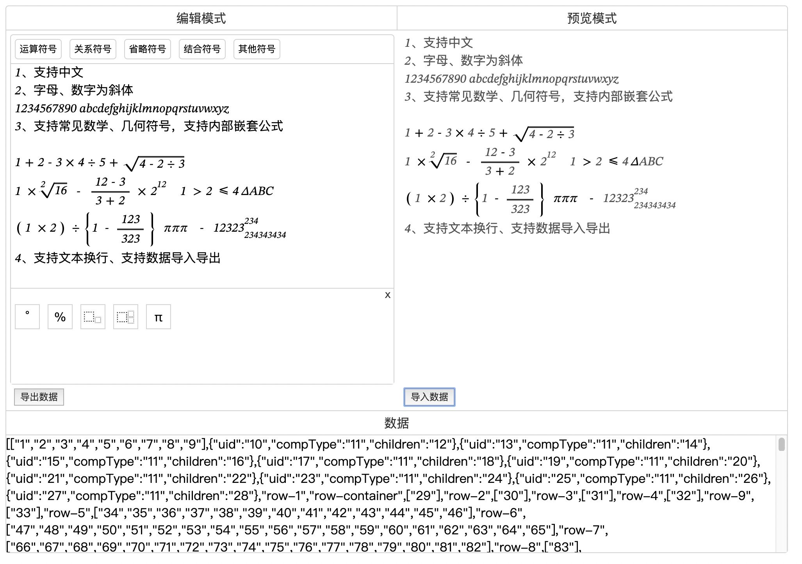

# 数学公式编辑器

基于vue框架数学公式编辑器



特性：
1、支持中文输入
2、字母、数字为斜体
3、支持常见数学、几何符号，支持符号内部嵌套公式
4、支持文本换行、支持数据导入导出

## 引用

```shell

# 开发版
yarn add ssh://git@code.vipkid.com.cn:3590/kongdeming/math-editor.git

```

```javascript

import Vue from 'vue'
import MathEditor from 'vue-math-editor'
import 'vue-math-editor/dist/math-editor.css'

// 在调用 new Vue() 启动应用之前执行
Vue.use(MathEditor)

```

## 使用示例

```html

<template>
    <math-editor 
        :mode="'edit'" 
        :height="'180px'"
        :normalFontSize="20"
        :smallFontSize="20"
        ref="mathTextEditor">
    </math-editor>
</template>

```

```javascript

// 获取公式编辑器数据
const data = this.$refs.mathTextEditor.getValue()
// 设置公式编辑器的数据
this.$refs.mathTextEditor.setValue(data)

```

## 参数 && 方法

| 参数 | 说明 | 类型 | 可选值 | 默认值 |
| :--- | :--- | :--- | :--- | :--- |
| mode | 编辑器模式：编辑模式、预览模式，<br> 预览模式无法编辑| string | edit / preview| preview |
| height | 编辑器高度 | string | - | 100% |
| normalFontSize | 文本字体大小 | number | - | 16 |
| smallFontSize | 角标字体大小，<br> 例如平方的指数部分 | number | - | 16 |
| textAreaWidth | 编辑器输入框宽度 | string | - | - |


| 方法 | 方法定义 | 参数 | 参数说明 |
| :--- | :--- | :--- | :--- |
| getValue | 获取公式编辑器的内容数据 | - | - |
| setValue | 设置公式编辑器的内容数据 | string | 公式编辑器的内容数据是具有一定的格式JSON，<br> 因此setValue的数据只能来自getValue获取到的数据 |
